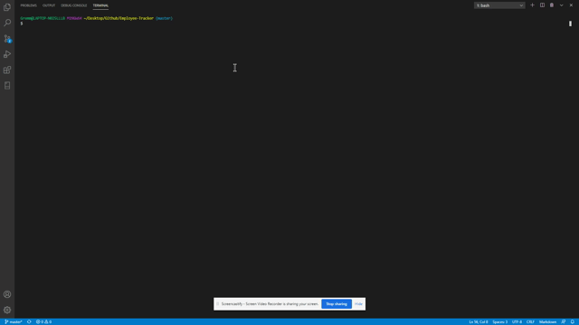
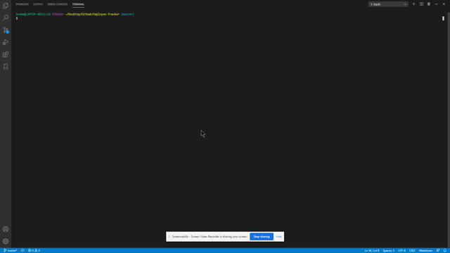

# Employee Tracker

   [](#License)

   ## Description
   This terminal run application will let you view track employees within an organization. You can view all of the employees in the organization, or only those employees in select departments or roles. You can also add new departments, roles, and employees. This app will also let you change the role of any employee in the organization.

   ## Table of Contents
   * [Installation](#Installation)
   * [Usage](#Usage)
   * [License](#License)
   * [Tests](#Tests)
   * [Questions](#Questions)
   
   ## Installation
   To install, please run the following code in the terminal:

   ```
   npm install mysql
   npm install inquirer
   npm install console.table
   ```

   You will also need to have MySQL installed on your computer. This readme does not walkthrough the steps to do that, so you will have to look elsewhere online for that information. I am using MySQL Workbench for the database, so I would recommend using that as well since I am not sure how well other programs will work with the code.

   ## Usage
   To use this app, copy the code from the employeeSchema.sql and the seed.sql files into MySQL Workbench to create the database and tables.
   
   Once that is done, please run the following code in the terminal:

   ```
   node index.js
   ```

   ## License
   The license assoiated with this project is MIT.
   To view the license information, visit the link [here](https://github.com/CalebParris/Employee-Tracker/blob/master/LICENSE)

   ## Tests
   To test the app, follow the directions from the Installation and Usage sections first. After that, you can use the app as follows:

   Here is a GIF showing how to view all the employees:

   

   Here is a GIF showing how to add a department:

   

   Here is a GIF showing how to update an empoyee's role:

   

   For a more thorough video walthrough, you can visit this link:
   
   [https://drive.google.com/file/d/1m9zShIYpmxfO-8eQb7zMea88nR9FWPy3/view?usp=sharing](https://drive.google.com/file/d/1m9zShIYpmxfO-8eQb7zMea88nR9FWPy3/view?usp=sharing)

   ## Questions
   If you have any comments, questions, or concerns about this project, please post them [here](https://github.com/CalebParris/Employee-Tracker/issues) and I will respond as soon as I am able.

   Otherwise, you can contact me through the following means:
   * Email: calebparris@live.com
   * Github: [CalebParris](https://github.com/CalebParris)
    
